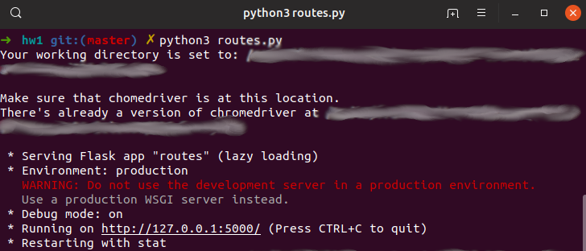

# Homework 1

Pasta com a solução do *Homework 1*. Uma descrição completa sobre este projeto pode ser encontrada abaixo. 

## O que aprendi?

> - Como utilizar a biblioteca `Selenium` para fazer _web scraping_ (navegação e extração de elementos da página).
> - Como criar uma rede (grafo) usando a biblioteca `Networkx` e extrair informações dessa rede.
> - Como criar um _website_ utilizando Python e `Flask`.
> - Como criar gráficos interativos com a biblioteca `Altair` e renderizar os gráficos em uma página _web_.

## Lista de Arquivos:

> - **static:** Elementos estáticos da página *web* (CSS e imagens estáticas).
> - **templates:** Templates html usados para renderizar o website.
> - **hw1.pdf:** Esse arquivo contém o enunciado (desafio) proposto em cada uma das etapas do projeto. 
> - **hw1.sqlite:** Base de dados em `SQLite` criada para armazenar as informações coletadas do *google scholar*.
> - **database_and_graphics.ipynb:** Notebook em Python com a descrição / documentação do código usado nas etapas de criação e atualização da base de dados, assim como das visualizações inseridas no _website_.
> - **database_and_graphics.py:** Código em Python para criação e atualização da base de dados e das visualizações (mesmo código que está documentado no arquivo .ipynb).
> - **routes.py:** *script* python que inicializa o website com `Flask` e suas funcionalidades.
> - **scholar.ipynb:** Notebook com a documentação do código utilizado na etapa de *web scraping*. Também explica como fazer o download do _chromedriver_ com as funções do módulo **scrape_scholar.py**.
> - **scrape_scholar.py:** *Script* em Python para coletar as informações do perfil do autor pesquisado no *Google Scholar*. Também contém uma função para fazer download automático do *chromedriver* (driver do google chrome necessário na etapa de _web scraping_)

--------------------

# Projeto: Google Scholar Networkx

## Descrição:

Ferramenta de _web scraping_ para extração e visualização de dados do [*Google Scholar*](https://scholar.google.com.br/). Essa ferramenta foi desenvolvida para coletar dados de publicação do autor pesquisado (título dos artigos publicados e coautores) e visualizar essas informações em uma rede interativa. 


## Requisitos:

Para executar o script **routes.py**, você precisará ter instalado:

###  - Google Chrome

É fundamental que se tenha o [google chrome](https://www.google.com/intl/en-US/chrome/) instalado em seu computador e o *chromedriver* na pasta raiz desse projeto. (**Um tutorial de como fazer o download da versão correta do *chromedriver* é apresentada ao fim desta página.**)

### - Anaconda (opcional)

Todos os *scripts* e códigos apresentados aqui foram desenvolvidos utilizando uma distribuição do [Anaconda](https://www.anaconda.com/) com Python 3. Apesar de opcional, recomenda-se a instalação de uma distribuição do Anaconda por já apresentar os pacotes básicos do Python 3 utilizados nesse projeto.


### - Bibliotecas em Python 3:

> [Altair](https://altair-viz.github.io/)  -  [BS4](https://www.crummy.com/software/BeautifulSoup/bs4/doc/)  -  [Flask](https://palletsprojects.com/p/flask/)  - [Networkx](https://networkx.github.io/)  - [Selenium](https://selenium-python.readthedocs.io/)  - [SQLite3](https://docs.python.org/3/library/sqlite3.html)


Se você não está usando uma distribuição do Anaconda, também será necessário fazer a instalação das seguintes bibliotecas:


> os  -  sys  -  time  -  urllib  -  zipfile (opcional)  -  pandas  -  matplotlib
<br>

Cada uma dessas bibliotecas pode ser instalada executando o seguinte comando em um terminal (obs: no Windows, o mesmo comando deve ser executado no Anaconda Prompt):

```sh
pip install nome_da_biblioteca
``` 
ou 
```sh
conda install nome_da_biblioteca
```
Se tiver instalado o Anaconda.


### - Sistema Operacional

Todo esse projeto foi desenvolvido e testado no sistema operacional Ubuntu 19.04. Porém, se atendidos os demais requisitos, todos os *scripts* devem funcionar em qualquer distribuição linux, assim como no Windows e OS X. 

<br>

## Tutorial

### - Download do *chromedriver*

Para que ferramenta de _web scraping_ funcione, é **fundamental** que se tenha o browser [Google Chrome](https://www.google.com/intl/en-US/chrome/) instalado, assim como o arquivo do *chromedriver* na pasta raiz desse projeto. 

O módulo **`scrape_scholar.py`** fornece uma alternativa para fazer a identificação e download do driver correto de maneira automática (que deve funcionar independente de qual sistema operacional você está utilizando). Ao executar o script principal **`routes.py`**, esse módulo tentará fazer o download do driver correto automaticamente.

Caso deseje, você pode fazer o download do chromedriver manualmente. Para isso, visite esse [link](https://chromedriver.chromium.org/downloads) e faça o download do arquivo correto de acordo com seu sistema operacional e versão do navegador. Para identificar qual versão do google chrome está instalada, basta abrir o navegador e executar o seguinte comando na barra de endereço:

```sh
chrome://version/
```


<br>

Se a alternativa acima não funcionar, aqui você encontra um mini tutorial sobre [como identificar a versão do google chrome instalada em seu computador](https://support.chall.com/hc/en-us/articles/200336349-How-do-I-determine-what-version-of-Google-Chrome-I-m-using-).

--------------------
**OBS:** Caso opte pelo *download* manual, não esqueça de descompactar o arquivo e colocá-lo na pasta raiz deste projeto.

------------------
<br>

### - Renderizando o *website* 

Uma vez que tenham sido cumpridos todos os requisitos citados acima, você está pronto para renderizar o *website*. Para isso, abra uma instância do terminal na pasta raiz do projeto (ou Anaconda Prompt, no Windows) e execute o seguinte comando:

```sh
python routes.py
```
ou 

```sh
python3 routes.py
```

Se tudo funcionou devidamente até aqui, você deverá visualizar uma tela semelhante a essa em seu terminal: 

<br>

<p align="center">

</p>

<br>

Ao acessar seu browser e navegar até o endereço `http` mostrado em seu terminal (http://127.0.0.1:5000/ - no caso mostrado na figura acima), você irá se deparar com a seguinte página:

<br>


<br>

A partir desse ponto, é só pesquisar o nome do autor e aguardar até que os gráficos sejam carregados na página seguinte. 

À medida que for pesquisando por novos autores, mais pontos surgirão em ambos os grafos. 

<br>

----------------

## Nota

Esse projeto foi apresentado como solução de um *homework* para a disciplina de Fundamentos de Data Sciente do curso de Mestrado em Matemática Aplicada - EMAp/FGV. Quaisquer comentários, sugestões e notificações são bem-vindos.

----------------
